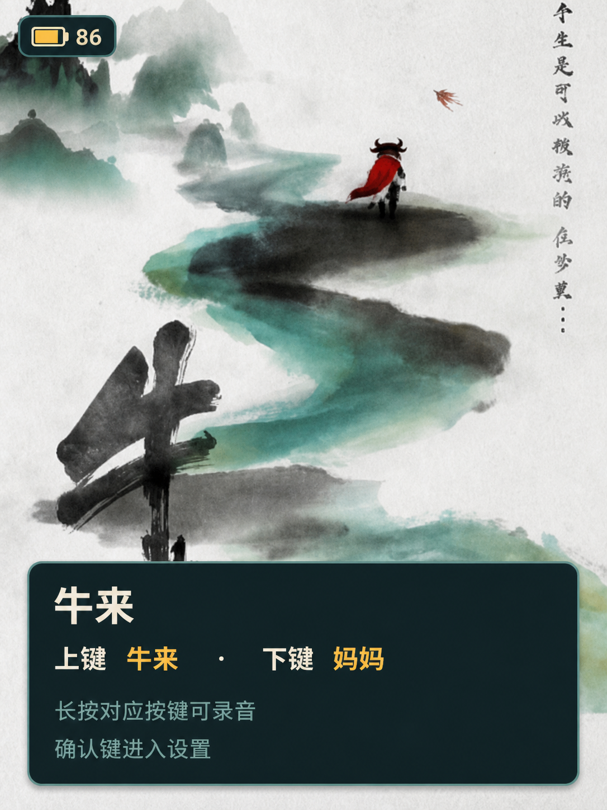

# FoloToy AI Passport 牛来互动播放器

[English](README.md) | 简体中文

[](https://github.com/JollySun/folo-ai-passport-niulai/actions/workflows/build.yml)
[](LICENSE)

这是一个运行在 ESP32-C3 FoloToy AI Passport 上的离线“牛来”互动播放器，集成角色动画、对白播放、电量显示、音量设置和自定义录音替换。

<p align="center">
  
</p>

> [!IMPORTANT]
> 本项目是非官方爱好者原型。MIT 许可证只覆盖源代码，不自动授权电影图片和音频。重新分发固件或素材前，请先阅读[素材来源与分发提示](apps/niulai/assets/SOURCES.md)。

## 功能

- 首页海报，以及牛来/妈妈双帧说话动画。
- 内置 16 kHz 单声道对白，支持软件音量控制。
- 每个角色最多录制 10 秒自定义声音，录制后替换对应内置声音。
- 独立 Flash 分区和双 Bank 提交，断电时不破坏上一份有效录音。
- 项目配色的 iOS 风格电量图标；CW2017 SOC 异常时使用电压估算降级。
- 全程使用三个实体按键，无需网络或账号。

## 按键

| 操作 | 页面 | 结果 |
| --- | --- | --- |
| 短按上键 | 非设置页 | 显示牛来并播放“妈妈～～” |
| 短按下键 | 非设置页 | 显示妈妈并播放“牛来！” |
| 长按上键后松开 | 牛来页 | 录制并保存牛来页声音 |
| 长按下键后松开 | 妈妈页 | 录制并保存妈妈页声音 |
| 短按确认键 | 任意页 | 进入设置；在设置页返回 |
| 双击确认键 | 设置页 | 删除两份自定义录音并恢复默认声音 |
| 长按确认键 | 任意页 | 停止声音并返回首页 |

安装、录音细节和故障排查见[使用说明](docs/USER_GUIDE.md)。

## 安装发布版

从 [GitHub Releases](https://github.com/JollySun/folo-ai-passport-niulai/releases/latest) 下载最新文件。

- 首次安装或分区表发生变化时，把 `*-full.bin` 烧录到地址 `0x0`。
- 只有设备已经使用本项目分区表时，才可把 `*-app.bin` 烧录到地址 `0x10000`。
- 使用 `SHA256SUMS` 校验下载文件。

录音依赖 `recordings` 分区，仅烧录应用镜像不能创建这个分区。

## 从源码构建

需要 FoloToy AI Passport、USB 数据线、Git、Rustup 和 ESP-IDF 5.5.3。

```bash
git clone https://github.com/JollySun/folo-ai-passport-niulai.git
cd folo-ai-passport-niulai
source "$HOME/esp/esp-idf/export.sh"
scripts/test.sh
scripts/build-app.sh niulai build
scripts/build-app.sh niulai flash monitor
```

完整环境安装、固件打包和烧录命令见[构建说明](docs/BUILDING.md)。

## 项目结构

```text
crates/passport-core/  可共用的 no_std 信号与电池计算
components/bsp_*/     可独立选择的板级硬件模块
apps/diagnostics/     最小 I2C 与电池诊断固件
apps/niulai/          牛来状态、C ABI、固件、测试和全部资源
tests/                共用的主机行为测试
scripts/              测试与固件打包入口
docs/                 使用、构建、架构和硬件文档
```

共用计算逻辑位于 Rust `passport-core` crate，所有牛来实现与资源均位于
`apps/niulai`，持久录音位于 `niulai_voice_store`，硬件访问统一经过 BSP
接口。运行任务与 Flash 布局见[架构说明](docs/ARCHITECTURE.md)。

## 开发

```bash
scripts/test.sh
scripts/build-app.sh niulai build
scripts/package-firmware.sh niulai build/niulai dist/niulai dev
scripts/build-app.sh diagnostics build
```

每个拉取请求都会执行主机测试，并为所有发现的应用执行完整 ESP-IDF
构建。推送 `<app>/v*` 标签（例如 `niulai/v1.0.0`）后，该应用会独立发布整机、应用、bootloader、分区表和校验和文件。

诊断工具可使用 `diagnostics/v1.0.0` 标签走同一套独立发布流程。

提交改动前请阅读[贡献指南](CONTRIBUTING.md)、[安全策略](SECURITY.md)和[变更记录](CHANGELOG.md)。

## 许可证与致谢

源代码使用 [MIT License](LICENSE)。媒体素材不自动适用该许可证，详见 [SOURCES.md](apps/niulai/assets/SOURCES.md)。

项目面向 [FoloToy AI Passport](https://github.com/FoloToy/ai-passport)，使用 [ESP-IDF](https://github.com/espressif/esp-idf)、LVGL、`esp_lvgl_port`、`button` 和 `esp_codec_dev` 构建。
