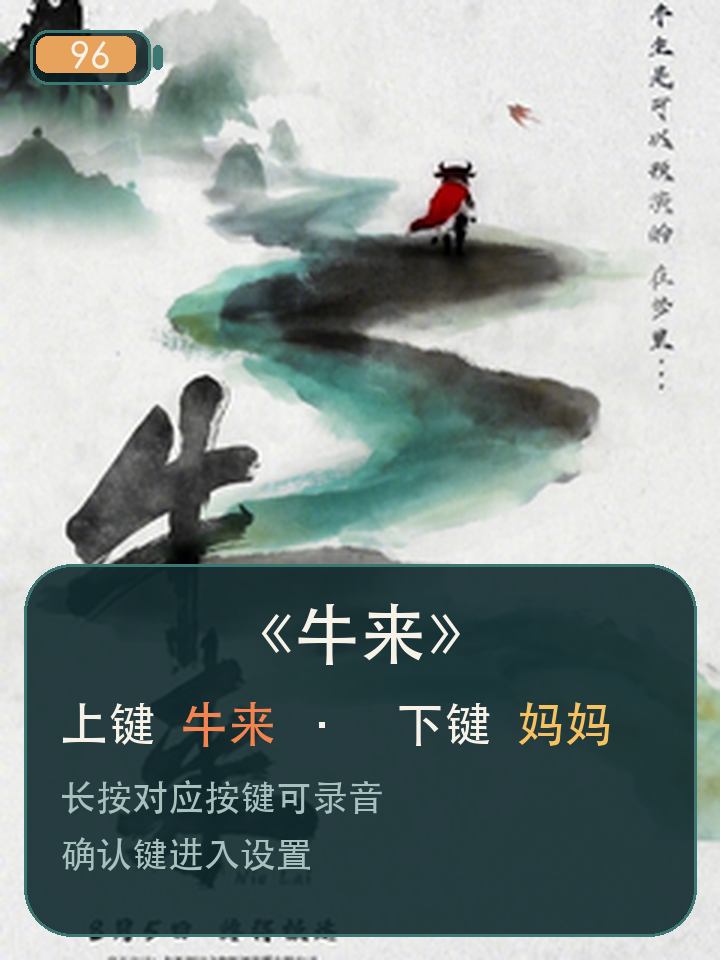
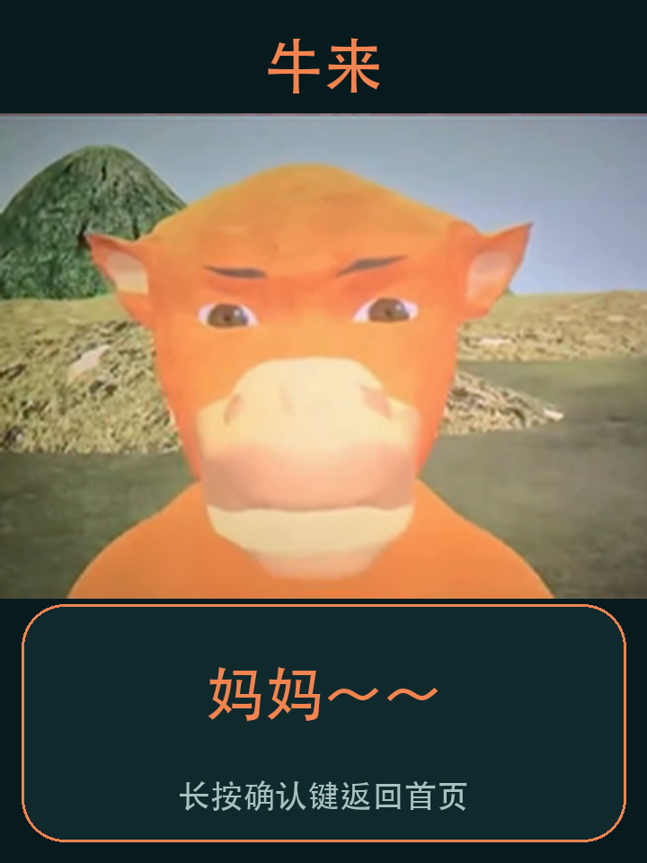
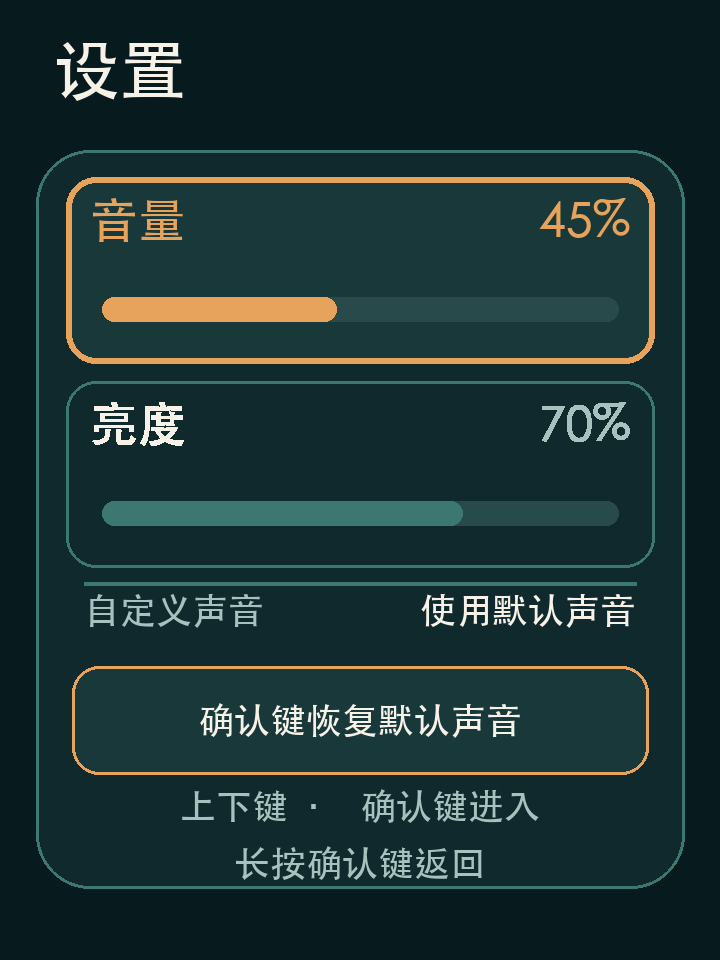

# FoloToy AI Passport 牛来互动播放器

[English](README.md) | 简体中文

[](https://github.com/JollySun/folo-ai-passport-niulai/actions/workflows/build.yml)
[](LICENSE)

这是一个运行在 ESP32-C3 FoloToy AI Passport 上的离线“牛来”互动播放器，集成角色动画、对白播放、电量显示、音量设置和自定义录音替换。

<p align="center">
  
</p>

> [!IMPORTANT]
> 本项目是非官方爱好者原型。MIT 许可证只覆盖源代码，不自动授权电影图片和音频。重新分发固件或素材前，请先阅读[素材来源与分发提示](assets/niulai/SOURCES.md)。

## 界面抓取

以下界面按照当前固件的 240×320 LVGL 布局和内置角色帧生成。LCD 使用
只写 SPI 接口，设备无法读回屏幕像素，因此这里是用于文档的界面抓取，
不是实体设备的相机照片。

<p align="center">
  
  
</p>
<p align="center">
  
  
</p>

## 功能

- 首页海报，以及牛来/妈妈双帧说话动画。
- 内置角色对白，支持调节播放音量。
- 每个角色最多录制 10 秒自定义声音，录制后替换对应内置声音。
- 自定义录音可在重启后继续使用，保存中断也不会覆盖上一份有效录音。
- 自定义声音播放结束时，角色动画同步停止。
- 项目配色的 iOS 风格电量图标；CW2017 SOC 异常时使用电压估算降级。
- 全程使用三个实体按键，无需网络或账号。

## 按键

| 操作 | 页面 | 结果 |
| --- | --- | --- |
| 短按上键 | 非设置页 | 显示牛来并播放“妈妈～～” |
| 短按下键 | 非设置页 | 显示妈妈并播放“牛来！” |
| 1.8 秒内重复短按上键或下键 | 非设置页 | 加强对应角色的字幕与动画反馈 |
| 1.8 秒内交替短按上键和下键 | 非设置页 | 用角色色闪动表现接话 |
| 长按上键后松开 | 牛来页 | 录制并保存牛来页声音 |
| 长按下键后松开 | 妈妈页 | 录制并保存妈妈页声音 |
| 短按确认键 | 非设置页 | 进入设置 |
| 短按确认键 | 设置页 | 激活/退出当前数值，或确认恢复默认声音 |
| 短按上键或下键 | 恢复默认声音确认中 | 取消恢复 |
| 长按确认键 | 设置页 | 返回进入设置前的页面 |
| 长按确认键 | 其他页面 | 停止声音并返回首页 |

设置页底部始终显示当前按键操作，第二行固定提示“长按确认键返回”。

连续 30 秒无操作且未在录音时，屏幕背光会关闭；之后第一次完整按键只负责唤醒屏幕，不会触发原操作。

安装、录音细节和故障排查见[使用说明](docs/USER_GUIDE.md)。

## 安装发布版

从 [GitHub Releases](https://github.com/JollySun/folo-ai-passport-niulai/releases/latest) 下载最新文件。

- 首次安装或分区表发生变化时，把 `*-full.bin` 烧录到地址 `0x0`。
- 只有设备已经使用本项目分区表时，才可把 `*-app.bin` 烧录到地址 `0x10000`。
- 使用 `SHA256SUMS` 校验下载文件。

如果仅更新应用后无法录音，请使用完整固件重新安装。

## 从源码构建

需要 FoloToy AI Passport、USB 数据线、Git 和 ESP-IDF 5.5.3。

```bash
git clone https://github.com/JollySun/folo-ai-passport-niulai.git
cd folo-ai-passport-niulai
source "$HOME/esp/esp-idf/export.sh"
scripts/test.sh
idf.py build
idf.py flash monitor
```

完整环境安装、固件打包和烧录命令见[构建说明](docs/BUILDING.md)。

## 项目结构

```text
components/bsp/       板级驱动和硬件常量
main/                 应用状态、UI、音频和录音存储
main/assets/niulai/   固件使用的 RGB565 与 PCM 素材
assets/niulai/        可预览素材和来源记录
tests/                不依赖硬件的 C 测试
scripts/              测试与固件打包入口
docs/                 使用、构建、架构和硬件文档
```

纯状态机位于 `niulai_model`，持久录音位于 `niulai_voice_store`，硬件访问统一经过 BSP 接口。运行任务与 Flash 布局见[架构说明](docs/ARCHITECTURE.md)。

## 开发

```bash
scripts/test.sh
idf.py build
scripts/package-firmware.sh build dist dev
```

每个拉取请求都会执行主机测试和完整 ESP-IDF 构建。推送 `v*` 标签后，发布工作流会生成整机、应用、bootloader、分区表和校验和文件。

提交改动前请阅读[贡献指南](CONTRIBUTING.md)、[安全策略](SECURITY.md)和[变更记录](CHANGELOG.md)。

## 许可证与致谢

源代码使用 [MIT License](LICENSE)。媒体素材不自动适用该许可证，详见 [SOURCES.md](assets/niulai/SOURCES.md)。

项目面向 [FoloToy AI Passport](https://github.com/FoloToy/ai-passport)，使用 [ESP-IDF](https://github.com/espressif/esp-idf)、LVGL、`esp_lvgl_port`、`button` 和 `esp_codec_dev` 构建。
